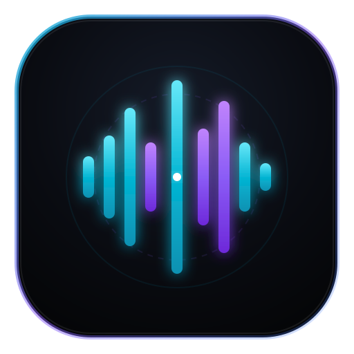

<p align="center">
  
</p>

<h1 align="center">EchoCore Pro</h1>

<p align="center">
  <strong>Neural voice studio and multi-provider speech engine — real-time voice cloning, ElevenLabs, x.ai, OpenRouter, and offline Piper neural TTS.</strong>
</p>

<p align="center">
  
  
  
  
  
</p>

<p align="center">
  <a href="#overview">Overview</a> •
  <a href="#features">Features</a> •
  <a href="#architecture">Architecture</a> •
  <a href="#tech-stack">Tech Stack</a> •
  <a href="#getting-started">Getting Started</a> •
  <a href="#production-build">Production Build</a>
</p>

---

## Overview

EchoCore Pro is a voice synthesis and cloning workstation designed for Linux and modern desktop workflows. It provides a unified single-window studio to clone voices from audio files or microphone recordings, write and refine scripts with AI, and synthesize studio-grade speech across local neural engines and cloud providers.

---

## Features

- **Instant voice cloning** — drag and drop a 15–60s reference audio sample or record directly from your microphone with real-time waveform input visualization
- **Unified studio workspace** — script editor, interactive audio workbench, and provider controls in a single cohesive window
- **Multi-provider speech synthesis** — seamless switching between ElevenLabs (cloned and premade voices), offline Piper ONNX, x.ai (Grok), and OpenRouter
- **Interactive waveform workbench** — WaveSurfer.js scrubber with millisecond precision, playback speed controls (0.5x–2.0x), looping, volume control, and single-click audio export
- **AI script polish** — integrated spoken delivery polish, podcast host tone adaptation, and dramatic narration rewriting via Grok or OpenRouter
- **Generation history** — persistent session history tray with instantaneous reload, playback, and download
- **Local-first credentials** — API keys and cloned profiles stored securely in `~/.config/echocore/`

---

## Architecture

- **Desktop Shell**: Tauri v2 (Rust) providing native desktop window integration via WebKitGTK
- **Frontend**: React 19, TypeScript, Tailwind CSS v4, Lucide React, WaveSurfer.js
- **Audio Engine**: Python FastAPI service on `127.0.0.1:8765`, Piper ONNX, SoundFile, NumPy
- **Persistence**: Safe on-device configuration and audio cache at `~/.config/echocore/`

```
┌────────────────────────────────────────────────────────────────────────┐
│                        TAURI V2 / BROWSER UI                           │
│  React 19 + TypeScript + Tailwind CSS v4 + WaveSurfer.js + Lucide-React │
├───────────────────────────────────┬────────────────────────────────────┤
│           Left Column             │            Right Column            │
│  • VoiceSelector                  │  • ScriptEditor                    │
│    - Cloned Voices filter         │    - Preset prompts (Podcast, etc) │
│    - Offline Piper filter         │    - AI Script Polish (Grok/OpenR) │
│    - Voice preview playback       │  • WaveSurferStudio                │
│    - Delete cloned voice          │    - Interactive waveform scrubber │
│  • VoiceClonerModal               │    - Play/Pause/Skip/Speed/Volume  │
│    - File upload (drag & drop)    │    - WAV/MP3 Export                │
│    - Live mic recording meter     │                                    │
├───────────────────────────────────┴────────────────────────────────────┤
│  • ProviderSettingsTray: ElevenLabs | Local Piper | x.ai | OpenRouter  │
│    - Stability, Similarity Boost, Speech Speed, Style sliders          │
│    - Primary Glowing "Render Cloned Voice" CTA (Ctrl+Enter)            │
│  • HistoryDrawer: Recent render caching with instant reload & delete   │
│  • SettingsModal: Local secure API credentials (~/.config/echocore)    │
└───────────────────────────────────┬────────────────────────────────────┘
                                    │ HTTP REST / Audio streaming
┌───────────────────────────────────▼────────────────────────────────────┐
│                    PYTHON FASTAPI ENGINE (127.0.0.1:8765)              │
│  server/main.py (FastAPI, Uvicorn, httpx, soundfile, onnxruntime, piper)│
├────────────────────────────────────────────────────────────────────────┤
│  • Local Synthesis: Piper ONNX Engine (en_US-lessac, sl_SI-artur)      │
│  • ElevenLabs API: /v1/voices/add (Instant Cloning), /v1/text-to-speech │
│  • x.ai (Grok): /v1/chat/completions (Script writing & spoken polish)  │
│  • OpenRouter API: Multi-model AI script generation & audio routing    │
│  • Persistence: ~/.config/echocore/ (config.json, history, clones)     │
└────────────────────────────────────────────────────────────────────────┘
```

---

## Tech Stack

| Layer | Technologies |
|---|---|
| Desktop Container | Tauri v2, Rust |
| Frontend | React 19, TypeScript, Vite, Tailwind CSS v4 |
| Audio Visualizer | WaveSurfer.js |
| Local TTS Engine | Piper ONNX, onnxruntime, soundfile, numpy |
| Backend Server | Python 3, FastAPI, Uvicorn, httpx |
| Cloud Providers | ElevenLabs (Voice Cloning + TTS), x.ai (Grok), OpenRouter |

---

## Getting Started

### Prerequisites

- Linux (x86_64 or ARM64) or macOS
- Node.js 18+ and npm
- Python 3.10+
- Rust & Cargo (for desktop binary compilation)

### Quick Run

```bash
git clone https://github.com/nodaysidle/nodaysidle-echocore-pro.git
cd nodaysidle-echocore-pro/EchoCorePro
./scripts/run.sh
```

To run in browser mode without the Tauri window:

```bash
./scripts/run.sh web
# Opens on http://localhost:1420
```

---

## Production Build

### Building the Desktop Binary

```bash
cd EchoCorePro
npm run build
npm run tauri build
```

The compiled binary will be located at `src-tauri/target/release/echocore-pro`.

### Desktop Launcher Integration (Linux / Omarchy)

Install the application into your local desktop environment:

```bash
# Executable
cp src-tauri/target/release/echocore-pro ~/.local/bin/

# Desktop entry
cp ~/.local/share/applications/echocore-pro.desktop ~/.local/share/applications/
update-desktop-database ~/.local/share/applications
```

Now search for **EchoCore Pro** in your application launcher (`Super + Space`).

---

## License

[MIT](LICENSE) © [NODAYSIDLE](https://github.com/nodaysidle)

<p align="center">
  Built by <a href="https://github.com/nodaysidle">NODAYSIDLE</a>
</p>
